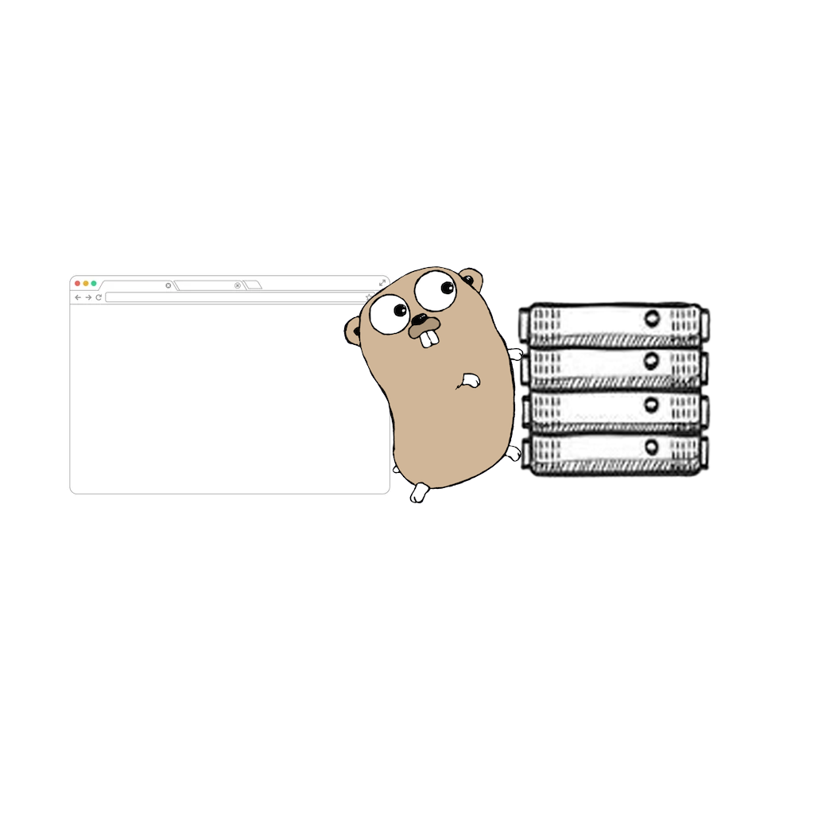

GoWest is a minimalistic [WebSocket](https://datatracker.ietf.org/doc/html/rfc6455) protocol implementation in Go.



## Installation
```
go install github.com/ystepanoff/gowest@latest
```

## Example usage

This repository contains an [example](https://github.com/ystepanoff/gowest/blob/main/examples/echo/server.go) of an 
echo WebSocket server.

## Development

This project was created to be used in other projects and is being updated according to those projects' demands, 
with the aim of becoming a complete implementation of the [WebSocket](https://datatracker.ietf.org/doc/html/rfc6455) 
protocol in the future. That said, any contributions in the form of pull requests are welcome.
