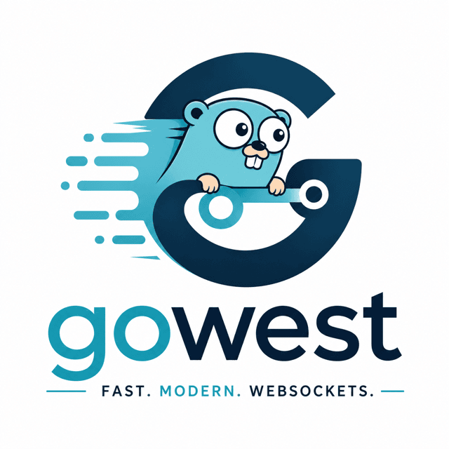

# gowest

**A fast, context-first WebSocket library for Go.**

[](https://github.com/ystepanoff/gowest/actions/workflows/ci.yml)
[](https://github.com/ystepanoff/gowest/actions/workflows/autobahn.yml)
[](https://pkg.go.dev/github.com/ystepanoff/gowest)
[](https://goreportcard.com/report/github.com/ystepanoff/gowest)



gowest is a server-side WebSocket library (RFC 6455) for Go. It pairs a
`context`-based API with concurrency-safe writes, low and constant per-message
allocation, and zero external dependencies. It is aimed at new Go services —
chat, real-time dashboards, streaming backends, multiplayer games — that need a
small, correct WebSocket server.

> **Status: beta.** Tests pass under the race detector and the Autobahn
> conformance suite passes in CI. The public API may still change before
> v1.0.0; see [Production Readiness](#production-readiness) for the full picture.

## Features

- **High-performance** — one allocation per `Read`, zero per `Write`, optimised
  for large payloads (see [Performance](#performance)).
- **Context-first API** for cancellation, timeouts and request-scoped operations.
- **Safe concurrent writes** with an explicit, tested concurrency model.
- **Zero external dependencies** — only the standard library.
- **RFC 6455 compliant**, validated by the Autobahn Test Suite in CI.
- **Configurable** origin validation, subprotocol negotiation and message-size
  limits.

## Installation

```bash
go get github.com/ystepanoff/gowest@latest
```

```go
import "github.com/ystepanoff/gowest"
```

Requires Go 1.19+.

## Quick start (server)

Upgrade an incoming HTTP request with `Accept`, then read and write messages on
the returned `*Conn`. This is a complete echo handler:

```go
func handler(w http.ResponseWriter, r *http.Request) {
	ctx := r.Context()

	c, err := gowest.Accept(ctx, w, r, nil)
	if err != nil {
		return
	}
	defer c.Close(gowest.StatusNormalClosure, "")

	for {
		typ, msg, err := c.Read(ctx)
		if err != nil {
			break // *gowest.CloseError on a clean peer close
		}
		if err := c.Write(ctx, typ, msg); err != nil {
			break
		}
	}
}
```

Passing `nil` options applies the safe defaults, including a **same-origin**
policy: cross-origin browsers are rejected. To accept other origins, pass
`&gowest.AcceptOptions{OriginPatterns: []string{"*"}}` (or specific hosts).

A complete, runnable program lives in [`examples/echo`](examples/echo). gowest is
server-side today (see the [roadmap](#roadmap)); to test against it, connect with
a browser or any WebSocket client.

- **Upgrade** — `Accept` validates the handshake, checks the origin, negotiates
  a subprotocol and returns a `*Conn`.
- **Read** — `(*Conn).Read` blocks until a complete message is available,
  handling ping/pong and close frames transparently. One goroutine at a time.
- **Write** — `(*Conn).Write` sends one message; safe to call concurrently.
- **Close** — `(*Conn).Close` performs the close handshake with a `StatusCode`
  and reason.

### Options

`AcceptOptions` controls the handshake:

| Field | Meaning |
| --- | --- |
| `OriginPatterns` | Allowed `Origin` host patterns (single `*` wildcard). Empty = same-origin only. |
| `Subprotocols` | Server-preferred subprotocols; the first match with the client is negotiated. |
| `MaxMessageBytes` | Maximum inbound message size; larger messages fail with `StatusMessageTooBig`. Unset (≤ 0) uses `DefaultMaxMessageBytes` (32 MiB), so connections are bounded by default. |
| `ReadBufferSize` / `WriteBufferSize` | Buffer sizes for the hijacked connection. |

## Why gowest?

The Go ecosystem already has capable WebSocket libraries. gowest explores a
specific point in the design space: a server that is context-first from the
ground up, allocation-light on the hot path, dependency-free, and exposes a
deliberately small API. If those priorities match your project, it should be a
natural fit.

### Design principles

- **Context-first** — every blocking call takes a `context.Context` for
  deadlines and cancellation.
- **Explicit concurrency** — a documented one-reader / many-writer contract,
  exercised in CI under the race detector.
- **Correctness before optimisation** — RFC 6455 conformance (Autobahn) gates CI.
- **Performance without obscurity** — hot paths are optimised but stay plain Go,
  with no `unsafe`.
- **Zero dependencies** — the standard library only.
- **Small API surface** — a single `Conn` type and a handful of methods.

## Concurrency guarantees

gowest follows the same one-reader / many-writer rule used by most production
WebSocket libraries:

- **`Write`** may be called concurrently from any number of goroutines. Writes
  are serialised internally with a mutex, so frames never interleave on the wire.
- **`Read`** must be called from **at most one goroutine at a time**. Reading
  from several goroutines concurrently corrupts the message stream and is a
  programming error.
- **`Close`** is safe to call concurrently with `Read`, `Write` and `Ping`, and
  is idempotent. It unblocks any in-flight operation, which then returns an error.
- **`Ping`** may be called concurrently with `Write`; pongs are observed by the
  goroutine calling `Read`.

Cancellation is implemented with `net.Conn` deadlines, not a per-call goroutine
that outlives the operation: a cancelled or timed-out `Read`/`Write` interrupts
the underlying I/O and fails the connection (a WebSocket stream cannot be safely
resumed mid-frame). The full contract is documented in the
[package docs](https://pkg.go.dev/github.com/ystepanoff/gowest). The suite runs
under the race detector in CI (`go test -race ./...`).

## Performance

**Takeaway:** on uncompressed payloads gowest is roughly **2× faster** than the
comparison libraries from 64 KiB upward, and allocates a **constant 3 buffers**
per echo regardless of message size. Small messages (≤ 1 KiB) are effectively
tied, because loopback round-trip latency dominates the framing cost.

The numbers below are a one-message echo round trip over a TCP loopback
connection, median of 10 runs on an Apple M4 Pro (Go 1.24); a single neutral
client drives every server, so the only variable per row is the server library.

| Payload        | gowest       | gorilla          | coder            | gobwas           |
| -------------- | ------------ | ---------------- | ---------------- | ---------------- |
| 32 B text      | **15.84 µs** | 15.97 µs         | 15.85 µs         | 17.20 µs (+9%)   |
| 1 KiB binary   | **15.96 µs** | 16.38 µs (+3%)   | 16.73 µs (+5%)   | 18.68 µs (+17%)  |
| 64 KiB binary  | **39.09 µs** | 69.14 µs (+77%)  | 70.31 µs (+80%)  | 73.44 µs (+88%)  |
| 1 MiB binary   | **211.3 µs** | 435.3 µs (+106%) | 445.0 µs (+111%) | 482.5 µs (+128%) |
| 10 MiB binary  | **1.706 ms** | 2.950 ms (+73%)  | 3.187 ms (+87%)  | 3.125 ms (+83%)  |

| allocs/op      | gowest | gorilla | coder | gobwas |
| -------------- | ------ | ------- | ----- | ------ |
| 32 B text      | **2**  | 3       | 2     | 6      |
| 1 KiB binary   | **3**  | 6       | 5     | 9      |
| 1 MiB binary   | **3**  | 34      | 31    | 35     |
| 10 MiB binary  | **3**  | 45      | 42    | 46     |

`Read` costs one allocation (the payload); `Write` costs zero. gowest holds a
constant 3 allocations per echo at every size.

### Benchmark caveats

- **Read these as relative, not absolute.** They were taken on one machine
  (Apple M4 Pro, Go 1.24) over **loopback TCP**, not a real network. Your
  hardware, Go version, OS and network will differ. Reproduce them yourself:
  `cd benchmarks && go test -bench=BenchmarkEcho -benchmem -count=10 .`
- **Small messages are latency-bound.** At 32 B–1 KiB a round trip is dominated
  by ~16 µs of loopback latency, so all libraries effectively tie there; the
  framing differences only emerge from ~64 KiB up.
- **Uncompressed only.** gowest does not implement permessage-deflate, so this
  compares the uncompressed path. With compression enabled, gorilla and coder
  trade CPU for bandwidth — a different trade-off this table does not cover.
- **gobwas** is driven through its idiomatic `wsutil` helpers (how most apps use
  it), not its lower-level manual frame API, which can allocate less with more
  caller code.
- The comparison libraries live in a separate `benchmarks/` module, so the
  gowest library itself stays dependency-free.

Full methodology and per-size data: [`BENCHMARKS.md`](BENCHMARKS.md).

## Protocol support

- [x] RFC 6455 server handshake (`Accept`) with origin checking
- [x] Text and binary messages, including fragmented messages
- [x] Automatic ping/pong replies; optional observation handlers
- [x] Close handshake with status codes and reasons
- [x] Subprotocol negotiation
- [x] Inbound message size limits (memory-exhaustion guard)
- [x] Context deadlines and cancellation on every operation
- [ ] Client dialing (`Dial`) — planned
- [ ] permessage-deflate compression — planned

Conformance is validated by the [Autobahn|Testsuite](https://github.com/crossbario/autobahn-testsuite).
Because gowest is server-only, the suite runs in fuzzing-client mode: Autobahn
connects to a gowest echo server and drives every RFC 6455 case. The
[Autobahn workflow](.github/workflows/autobahn.yml) runs the full suite on every
push and **fails the build if any case regresses** — `autobahn/check_report.py`
parses the report and treats anything other than `OK` / `NON-STRICT` /
`INFORMATIONAL` / `UNIMPLEMENTED` as a failure (`wstest` itself always exits 0,
so this gate is what makes the result meaningful). Run it locally with
`make autobahn`; see [`autobahn/README.md`](autobahn/README.md) for details.

## Comparison

| | gowest | gorilla/websocket | coder/websocket |
| --- | --- | --- | --- |
| API style | context-first | callback/deadline | context-first |
| Server (`Accept`) | ✅ | ✅ | ✅ |
| Client (`Dial`) | ❌ (planned) | ✅ | ✅ |
| Concurrent writers | ✅ (mutex) | ❌ (one writer) | ✅ |
| permessage-deflate | ❌ (planned) | ✅ | ✅ |
| External dependencies | none | none | none |
| Uncompressed echo throughput (64 KiB+) | fastest in this set (see [Performance](#performance)) | baseline | baseline |
| Allocations per echo | constant (3) | grows with size | grows with size |
| Maintenance | beta, single-maintainer | mature, archived¹ | actively maintained |

¹ gorilla/websocket is widely deployed but its repository is in maintenance mode.

gowest's focus today is a high-performance WebSocket **server**: a small,
dependency-free, context-first API with low, constant per-message overhead.
Client dialing and permessage-deflate are tracked on the [roadmap](#roadmap).

## Production Readiness

gowest is designed for production use as a server-side WebSocket library. The
following capabilities are implemented and verified in the repository; the table
reflects the current state rather than an aspiration.

| Capability                  | Status | Evidence |
| --------------------------- | ------ | -------- |
| RFC 6455 framing & handshake | ✅ | [`frame.go`](frame.go), [`accept.go`](accept.go) |
| Autobahn Test Suite          | ✅ | gated in [CI](.github/workflows/autobahn.yml), harness in [`autobahn/`](autobahn/) |
| Safe concurrent writes       | ✅ | mutex-serialised `Write`; see [Concurrency guarantees](#concurrency-guarantees) |
| Race detector in CI          | ✅ | `go test -race` in [CI](.github/workflows/ci.yml) |
| Unit & integration tests     | ✅ | [`conn_test.go`](conn_test.go), [`context_test.go`](context_test.go), [`frame_test.go`](frame_test.go) |
| Zero runtime dependencies    | ✅ | standard library only ([`go.mod`](go.mod)) |
| Benchmarks vs gorilla/coder/gobwas | ✅ | [`BENCHMARKS.md`](BENCHMARKS.md) |
| Server (`Accept`)            | ✅ | |
| Client (`Dial`)              | 🚧 | planned ([roadmap](#roadmap)) |
| permessage-deflate           | 🚧 | planned ([roadmap](#roadmap)) |
| API stability                | Beta | pre-v1.0 |

### API stability

gowest is pre-v1.0. The public API is expected to remain stable, although minor
breaking changes may still occur before the first tagged release (v1.0.0). After
v1.0 the public API will follow semantic versioning.

### Scope and limitations

gowest currently focuses on the server side of RFC 6455. Client dialing (`Dial`)
and permessage-deflate compression are planned (see the [roadmap](#roadmap));
`wss://` is supported by terminating TLS at your server or reverse proxy. As with
any networking library, validate it under your own workload and traffic patterns
before production deployment.

## Roadmap

**Next**
- Client-side dialing (`Dial`).

**Planned**
- permessage-deflate compression.
- TLS / `wss://` helpers.

**Future**
- Additional ecosystem integrations.
- A dedicated writer goroutine as an alternative to the write mutex.

## Migrating from the legacy API

The original `GetConnection`, `Read` and `WriteString` functions remain
available but are **deprecated**. Prefer `Accept` and the `Conn` methods, which
add context support, concurrency safety, origin checks and control-frame
handling.

## Development

```sh
make help     # list targets
make check    # vet + test + race + benchmark compile (what CI runs)
make bench    # cross-library echo benchmarks
make autobahn # RFC 6455 conformance suite (requires Docker)
```

## Contributing

Issues and pull requests are welcome — especially production feedback, Autobahn
results on your platform, and benchmark numbers from other hardware.
